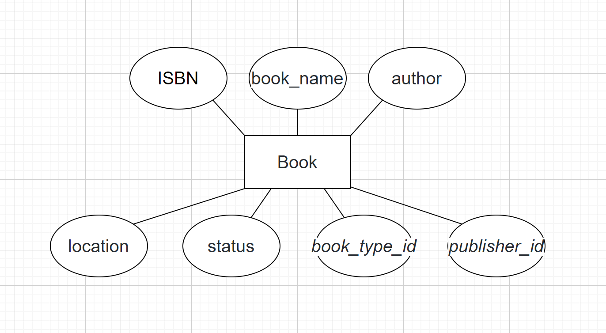
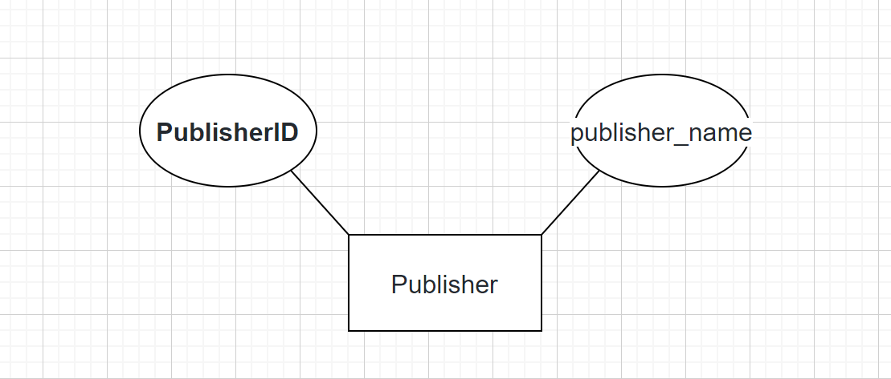

## 引言
利用所学数据库知识，设计图书管理系统。

## 1.需求分析

### 1.1 业务需求

图书室管理系统对现代图书馆而言，是能够发挥其科研的作用的至关重要的技术平台，对于读者和图书管理员来说，是否方便快速获取信息的关键，所以，图书管理系统要能够为用户提供充足的信息和快捷方便的操作手段。

### 1.2 用户需求

在图书管理系统当中，用户应该分为图书管理员和读者。从读者的角度，该系统应该具备查询图书馆内的数据信息、借书、还书等功能；从图书管理员的角度来看，该系统应该具备管理图书馆内的图书（增加、删除、修改、查询图书）、管理读者的借阅记录、对读者用户进行创建、修改、删除等操作。

### 1.3 系统需求

该系统分为四大模块，分别是用户信息、查询图书、借阅图书、借阅记录。

1. **用户信息**：展示读者的基本信息（账号ID、用户名、姓名、电话、最近登录时间、账号信息、账号状态、信用点、最长可借阅天数、最多可借阅本数），在这个模块里面可以对读者账号进行增加、删除、修改、恢复等功能，同时也可以查看被删除的用户。
2. **查询图书**：图书管理员可以录入图书信息，录入的信息会存入书目库，也可以修改图书信息，发送修改事务到修改图书信息功能，修改后的信息也会存入书目库，同时也可以删除图书信息，发送删除事务到删除图书信息功能，向书目库发送删除记录，删除对应的图书记录。图书管理员也可以查询图书信息，从书目库中取出相应的图书信息，供图书管理员查询信息。
   图书的基本信息包含ISBN、书名、作者、图书位置、图书类别、出版社。
3. **借阅图书**:图书管理员可以录入借阅记录，录入的信息会存入数据库，同时也可以修改、删除、查询借阅记录。
4. **借阅记录**：借阅记录的基本信息包含：操作序列号、借阅时间、图书状态、归还时间、借阅图书、借阅人。

## 2.所用开发工具和技术

### 2.1 数据库

数据库使用了MySQL。MySQL作为关系型数据库，基于其高可操作性和存储一致性，主要用于存储图书和用户等相关信息。MySQL 是一个高性能且相对简单的数据库系统，与一些更大系统的设置和管理相比，其复杂程度较低。

### 2.2 前后端

前后端使用了Django，Django是一个高级的 Python 网络框架，可以快速开发安全和可维护的网站。Django有开源框架和完美的文档分析支持，自助式的后端管理。Django 可以使开发的应用具有以下优点：

1. **完备性**：Django 遵循“功能完备”的理念，提供开发人员可能想要“开箱即用”的几乎所有功能。因为你需要的一切都是一个“产品”的一部分，它们都可以无缝结合在一起，遵循一致性设计原则，并且具有广泛和最新的文档。
2. **通用性**：Django 可以（并已经）用于构建几乎任何类型的网站—从内容管理系统和维基，到社交网络和新闻网站。它可以与任何客户端框架一起工作，并且可以提供几乎任何格式（包括 HTML，Rss 源，JSON，XML 等）的内容。在内部，尽管它为几乎所有可能需要的功能（例如几个流行的数据库，模版引擎等）提供了选择，但是如果需要，它也可以扩展到使用其他组件。
3. **安全性**：Django 帮助开发人员通过提供一个被设计为“做正确的事情”来自动保护网站的框架来避免许多常见的安全错误。例如，Django 提供了一种安全的方式来管理用户账户和密码，避免了常见的错误，比如将 session 放在 cookie 中这种易受攻击的做法（取而代之的是 cookies 只包含一个密钥，实际数据存储在数据库中）或直接存储密码而不是密码哈希（密码哈希是通过密码散列函数发送密码而创建的固定长度值）。Django 能通过运行哈希函数来检查输入的密码 - 加密 - 将输出的哈希值与存储的哈希值进行比较是否正确。然而由于功能的“单向”性质，即使存储的哈希值受到威胁，攻击者也难以解决原始密码。默认情况下，Django 可以防范许多漏洞，包括 SQL 注入，跨站点脚本，跨站点请求伪造和点击劫持。
4. **可扩展**：Django 使用基于组件的“无共享”架构 （架构的每一部分独立于其他架构，因此可以根据需要进行替换或更改). 在不用部分之间有明确的分隔意味着它可以通过在任何级别添加硬件来扩展服务：缓存服务器，数据库服务器或应用程序服务器。一些最繁忙的网站已经成功地缩放了 Django，以满足他们的需求（例如 Instagram 和 Disqus）。
5. **可维护性**：Django 代码编写是遵照设计原则和模式，鼓励创建可维护和可重复使用的代码。特别是它使用了不要重复自己（DRY）原则，所以没有不必要的重复，减少了代码的数量。Django 还将相关功能分组到可重用的“应用程序”中，并且在较低级别将相关代码分组或模块（ 模型视图控制器 (MVC) 模式）.
6. **灵活性**：Django 是用 Python 编写的，它在许多平台上运行。这意味着你不受任务特定的服务器平台的限制，并且可以在许多种类的 Linux，Windows 和 Mac OsX 上运行应用程序。此外，Django 得到许多网络托管提供商的好评，他们经常提供特定的基础设施和托管 Django 网站的文档。

## 3.数据库设计

### 3.1概念结构设计

#### 3.1.1 设计E-R图

（1）图书（Book）E-R图如图3.1：



<center><strong>图3.1</strong></center>

（2）读者（user）E-R图如图3.2：


<center><strong>图3.2</strong></center>

（3）借阅记录（borrow）E-R图如图3.3：


<center><strong>图3.3</strong></center>

（5）出版社（Publisher）E-R图如图3.4：



<center><strong>图3.4</strong></center>

（6）图书类别（BookType）E-R图如图3.5：


<center><strong>图3.5</strong></center>

（7）各表之间的E-R图如图3.6：


<center><strong>图3.6</strong></center>图3.7

#### 3.1.2 事务需求

1. 数据录入
   录入图书基本信息、录入读者基本信息、录入借阅记录基本信息
2. 数据更新/删除
   更新/删除图书、更新/删除读者账号、更新/删除借阅记录
3. 数据查询
   查询图书信息、查询借阅记录、查询读者

#### 3.1.3 数据项列表

```sql
mysql> desc Publisher;
+----------------+-------------+------+-----+---------+----------------+
| Field          | Type        | Null | Key | Default | Extra          |
+----------------+-------------+------+-----+---------+----------------+
| PublisherID    | int         | NO   | PRI | NULL    | auto_increment |
| publisher_name | varchar(40) | NO   |     | NULL    |                |
+----------------+-------------+------+-----+---------+----------------+
2 rows in set (0.00 sec)

mysql> desc BookType;
+----------------+-------------+------+-----+---------+----------------+
| Field          | Type        | Null | Key | Default | Extra          |
+----------------+-------------+------+-----+---------+----------------+
| BookTypeID     | int         | NO   | PRI | NULL    | auto_increment |
| book_type_name | varchar(40) | NO   |     | NULL    |                |
+----------------+-------------+------+-----+---------+----------------+
2 rows in set (0.01 sec)

mysql> desc Book;
+--------------+-------------+------+-----+---------+-------+
| Field        | Type        | Null | Key | Default | Extra |
+--------------+-------------+------+-----+---------+-------+
| ISBN         | varchar(20) | NO   | PRI | NULL    |       |
| book_name    | varchar(40) | NO   |     | NULL    |       |
| author       | varchar(40) | NO   |     | NULL    |       |
| location     | varchar(20) | NO   |     | NULL    |       |
| status       | varchar(5)  | NO   |     | NULL    |       |
| book_type_id | int         | NO   | MUL | NULL    |       |
| publisher_id | int         | NO   | MUL | NULL    |       |
+--------------+-------------+------+-----+---------+-------+
7 rows in set (0.00 sec)

mysql> desc Users;
+------------------+---------------+------+-----+---------+----------------+
| Field            | Type          | Null | Key | Default | Extra          |
+------------------+---------------+------+-----+---------+----------------+
| UserID           | int           | NO   | PRI | NULL    | auto_increment |
| name             | varchar(40)   | NO   |     | NULL    |                |
| nickname         | varchar(20)   | NO   |     | NULL    |                |
| password         | varchar(1024) | NO   |     | NULL    |                |
| tel              | varchar(11)   | NO   |     | NULL    |                |
| is_admin         | tinyint(1)    | NO   |     | NULL    |                |
| is_staff         | tinyint(1)    | NO   |     | NULL    |                |
| is_active        | tinyint(1)    | NO   |     | NULL    |                |
| last_login       | datetime(6)   | NO   |     | NULL    |                |
| trustworthiness  | int           | YES  |     | NULL    |                |
| max_borrow_day   | int           | YES  |     | NULL    |                |
| max_borrow_count | int           | YES  |     | NULL    |                |
+------------------+---------------+------+-----+---------+----------------+
12 rows in set (0.01 sec)

mysql> desc Borrow;
+----------------+-------------+------+-----+---------+----------------+
| Field          | Type        | Null | Key | Default | Extra          |
+----------------+-------------+------+-----+---------+----------------+
| OperationID    | int         | NO   | PRI | NULL    | auto_increment |
| borrow_time    | datetime(6) | NO   |     | NULL    |                |
| status         | varchar(8)  | NO   |     | NULL    |                |
| give_back_time | datetime(6) | NO   |     | NULL    |                |
| book_id        | varchar(20) | NO   | MUL | NULL    |                |
| user_id        | int         | NO   | MUL | NULL    |                |
+----------------+-------------+------+-----+---------+----------------+
6 rows in set (0.00 sec)
```

#### 3.1.4 系统实体

图书（Book）
用户（Users）
借阅记录（Borrow）
出版社（Publisher）
图书类别（BookType）

### 3.2逻辑结构设计

#### 3.2.1 转换规则

一个实体型转换成一个关系模型。实体的属性就是关系的属性，实体的码就是关系的码。
实体型间的关系常有如下不同的情况：

1. 一个$1:1$联系可以转换为一个独立的关系模式，也可以任意一端对应的关系模式合并。
2. 一个$1:n$联系可以转换成一个独立的关系模式，也可以与n端对应的关系模式合并。
3. 一个$m:n$联系转换成一个关系模式。
4. 3或3个以上实体间的一个多联系可以转换成一个关系模式。
5. 具有相同码的关系模式可合并。

#### 3.2.2 关系模型

图书（ISBN，图书名称，图书类别，作者，图书位置，出版社）
出版社（出版社ID，出版社名称）
图书类别（图书类别ID，图书类别名称）
图书记录（操作序列号，操作时间，操作类型，图书ID，读者ID）
借阅记录（操作序列号，借阅时间，图书状态，归还时间，图书ID，借阅人ID）

### 3.3物理结构设计

#### 3.3.1 创建数据库

通过`mysql -u root -p`进入MySQL数据库终端，执行以下两个语句来创建数据库：

```sql
CREATE DATABASE LIMS;
USE LIMS
```

#### 3.3.2 创建基本表

登录数据库之后，在LIMS数据库内依次执行如下命令：

```sql
create table Publisher (
    PublisherID int auto_increment,
    publisher_name varchar(40) not null,
    PRIMARY KEY (PublisherID)
);

create table BookType (
    BookTypeID int auto_increment,
    book_type_name varchar(40) not null,
    PRIMARY KEY (BookTypeID)
);

create table Book (
    ISBN varchar(20),
    book_name varchar(40) not null,
    author varchar(40) not null,
    location varchar(20) not null,
    status varchar(5) default 'IN' not null CHECK (status in ('IN', 'OUT', 'LOST')),
    book_type_id int not null,
    publisher_id int not null,
    PRIMARY KEY (ISBN),
    FOREIGN KEY (publisher_id) REFERENCES Publisher(PublisherID),
    FOREIGN KEY (book_type_id) REFERENCES BookType(BookTypeID)
);

create table Users (
    UserID int auto_increment,
    name varchar(40) not null,
    nickname varchar(20) not null,
    password varchar(1024) not null,
    tel varchar(11) not null,
    is_admin tinyint(1) not null,
    is_staff tinyint(1) not null,
    is_active tinyint(1) default 1 not null CHECK (is_active in (0, 1)),
    trustworthiness int default 100 CHECK (trustworthiness between 0 and 100),
    max_borrow_day int,
    max_borrow_count int,
    PRIMARY KEY (UserID)
);

create table Borrow (
    OperationID int auto_increment,
    borrow_time datetime(6) not null,
    status varchar(8) not null CHECK (status in ('在借', '归还', '损坏', '丢失', '迟交')),
    give_back_time datetime(6) not null,
    book_id varchar(20) not null,
    user_id int not null,
    PRIMARY KEY (OperationID),
    FOREIGN KEY (user_id) REFERENCES Reader(ReaderID),
    FOREIGN KEY (book_id) REFERENCES Book(ISBN)
);
```

起初小组是这样初始化数据库的，但随着开发进行，我们已经可以使用更简单的自动化手段来创建表，并写了对应的自动化shell和bat脚本：

```shell
python Django/manage.py makemigrations
python Django/manage.py migrate
python Django/manage.py createsuperuser --UserID 0 --name root --nickname root --password bassword --tel 15904572408
```

### 3.4数据库各项技术的综合使用

#### 1.是否合理设置索引

经过小组讨论，我们认为：

- **图书**：ISBN、book_name、author三个字段的查询频率较高，因此为该三个字段创建了索引。
- **用户**：UserID、name两个字段的查询频率较高，因此为该两个字段创建了索引。
- **借阅记录**：OperationID、borrow_time两个字段的查询频率较高，因此为该两个字段创建了索引。

#### 2.SQL语句的优化是否有所考虑

在查询模块开发过程中，小组都避开了嵌套子查询的行为，并且在不定项多条件组合查询中仅当通过后端的筛选整合完成后才提交查询请求到数据库中，从而避免了一次数据查询发送多个查询请求的低效情况。

#### 3.能否合理使用存储过程和触发器

由于本项目中有信用点系统，因此我们为用户的借阅记录状态设置了触发器，当该记录的图书状态分别为在借、归还、损坏、丢失、迟交五种中的一种时，触发器会根据对应的状态来变更用户信用点，同时在状态被设置归还、损坏和迟交的情况下图书表中状态会被自动更新为IN，其他情况会被更新为OUT。

#### 4.数据库安全性是如何考虑的（比如存取控制策略），杜绝SQL注入

最初考虑选择开发技术栈的时候就考虑过安全问题。最后我们发现，由于Django有QuerySets的存在，在被参数化查询构建出来时就被保护从而免于 SQL 注入，而且查询的 SQL 代码与查询的参数是分开定义的，因此即使进行SQL注入，也只会注入到QuerySets内，而不会直接和数据库进行交互。此外，即使参数化查询中参数可能来自用户因而不安全，但它们都由底层数据库引擎进行转义，可以保证数据库的安全性。同时我们在开发的过程中也避开了使用`extra()`和`RawSQL`的功能，因此从很大程度上安全性是可靠的。

除了SQL注入之外，Django也防御了跨站点请求伪造，提到这个是因为本项目开发的较多请求是要从前端建立与后端的联系的，会直接影响到数据库的安全，因此为了避免CSRF跨域攻击，我们在发送请求的时候都会附加一个CSRF令牌，并且通过这个令牌来验证请求的有效性，从而保证了来自用户的请求是合法的，进而保证数据库的安全。另外，我们也使用了HTTPS协议进行通信，有效防止了CSRF漏洞。

此外，我们在开发的过程中也避免了如`<style class={{ var }}>...</style>`的写法，可以有效地阻断XSS攻击；Django也带有防御访问劫持的功能，可以`X-Frame-Options middleware`的形式在支持它的浏览器中阻止一个网页被渲染在`frame`的内部，在每个视图的基础上禁用保护。

#### 5.数据库完整性约束

我们在开发过程中在前端设计好逻辑来阻止用户的不规范输入，并且在后端也做了相应的检查，最后还在数据库初始化建表的期间设计好了各属性的约束，可以避免用户的多数不规范输入导致的数据库存储错误的或脏的数据。

#### 6.非关系数据库Redis的合理使用

由于在Django中参数化查询是基于QuerySets的，而QuerySets是惰性执行的，创建查询集不会带来任何数据库的访问。仅当QuerySets需要求值时，Django才会真正运行这个查询，并且会按照Django的缓存机制将执行的结果保存在内存中，因此遇到多次重用也不会影响查询性能，因此我们小组认为没有必要使用Redis数据库来支持高性能快速查询。

## 4.详细设计与实现

### 4.1 前后端创建

首先，我们根据系统框架，数据库结构设计了对应界面的前后端<此处写我们设计的前后端名称>，而此次我们的项目开发是基于个人全栈开发，不分离前后端，并采用动态与静态相结合的更新方式，执行交互展示操作，同时，在细节功能开发的同时进行模块化设计，根据对各页面的熟悉程度分配具体工作，最终得以实现这个复杂的系统。

### 4.2 用户登录注册

首先，在进入图书管理系统后，首次进入页面，会弹出有登录注册操作，若不进行登录注册操作，将无法执行任何操作，而在登录注册操作后，系统会拉取后台数据库的用户信息，根据用户信息来判断当前登录注册的用户身份，如：管理员，普通用户，并根据用户身份与用户数据开放对应权限的相关数据的展示与操作。

### 4.3用户信息模块：

在用户信息模块中，我们根据需求设计了表属性：

- UserID: 主键，表示当前用户的ID，具有独一性
- Name: 系统给当前用户分配的用户名，可修改
- Nickname: 昵称，用户自行定义，展示在其他读者面前的名字
- Password: 密码，当前用户登录使用的密码
- Tel: 电话，当前用户的联系电话，电话内定义的数据格式为str，即可在电话中加入区号
- Is_admin: 判断当前用户是否为管理员
- Is_staff: 判断当前用户是否为图书馆员工
- Is_active: 判断当前账号是否为正常可用状态
- Last_login: 当前用户最后一次登录时间
- Trustworthiness: 当前用户的信用点，用以进行触发器判断
- max_borrow_day: 最大借阅天数
- max_borrow_count: 最大借阅数量

在该模块中，我们实现了不定项条件查询，基于用户的现实不同需求，用户可以随意添加条件：当前用户id，用户名，昵称，电话，近几日登录，信用点大小范围并进行查询，且我们会根据当前用户的权限就行查找并返回结果，在其中用户名和昵称根据现实情况采用了不区分大小写的模糊查找，信用点的输入在前端部分做好了安全性检查，以减少后端工作量，最后采用表单post更新的方式以最快速度返回结果，并且不需进行路由跳转即可完成

### 4.4查询图书模块：

在查询图书模块中，我们根据需求设计了表属性：

- ISBN: 主键，表示图书的ISBN
- book_name: 表示图书的名称
- Author: 图书对应作者的名字
- Location: 当前图书存放在图书馆中的具体位置
- Status: 当前图书的状态
- book_type_id: 外键，图书的类别
- publisher_id: 外键，出版社的名称

同上，在该模块中，我们也实现了不定项条件查询，基于用户的现实不同需求，用户可以随意添加条件：图书ISBN，书名，图书作者，图书类型，出版社名称并进行查询，且任何用户在该部分都具有对图书的完全查找权，不分离管理员权限，以加快前后端反应速度，以降低大批量数据查找的耗时，因该部分在现实意义上模糊搜索效果更好，所以，除了ISBN外，该部分的搜索条件，全部应用了不区分大小写的模糊查找，最后采用表单post更新的方式以最快速度返回结果，并且不需进行路由跳转即可完成

### 4.5借阅记录访问模块：

- OperationID: 主键，记录操作ID
- borrow_time: 记录借阅操作的发生时间
- Status: 记录该次借阅操作的图书状态
- give_back_time: 记录本次借阅操作的图书归还时间
- book_id: 外键，记录借阅的图书id
- user_id: 外键，记录借阅人的id

同上，在该模块中，我们也实现了不定项条件查询，基于用户的现实不同需求，用户可以随意添加条件：近几日借阅时间，图书状态，图书id，借阅人id并进行查询，因该部分数据涉及图书管理内部操作，故该部分只限管理员权限成员访问，且以上部分数据不适合使用模糊搜索，采用区分大小写的全字搜索就行搜索，时间上根据当前日期向前推进日期，最后采用表单post更新的方式以最快速度返回结果，并且不需进行路由跳转即可完成
分模块进行设计，小组成员分着写这一部分，然后合在一起。
这一个部分就是详细的将自己的系统详细设计与实现介绍清楚。设计就是画流程图之类，并配上文字说明。实现就是实现效果（截图）配上关键代码、文字说明是怎么做出来这样的结果的。
结构可以灵活些，比如根据流程顺序分块介绍，比如根据用户分类的功能介绍。
但是需要注意：（1）不能只有图和代码，必须有文字说明介绍（2）不能大段大段代码，只能是关键的代码。而且如果出现代码，那么必须有文字说明（不是代码上的注释）。（3）如果有用到设计模式的同学，这里可以好好的写写。。。。。。。。。。。

## 5.测试

### （1）功能测试

根据需求，将系统分为多个场景，以场景为主线，结合等价类划分、边界值分析等等设计测试用例，进行测试。测试发现问题，进行修改，修改后进行回归测试。。。。。。。。

### （2）web开发

兼容性测试：
性能测试：

## 6  存在的问题及改进思路