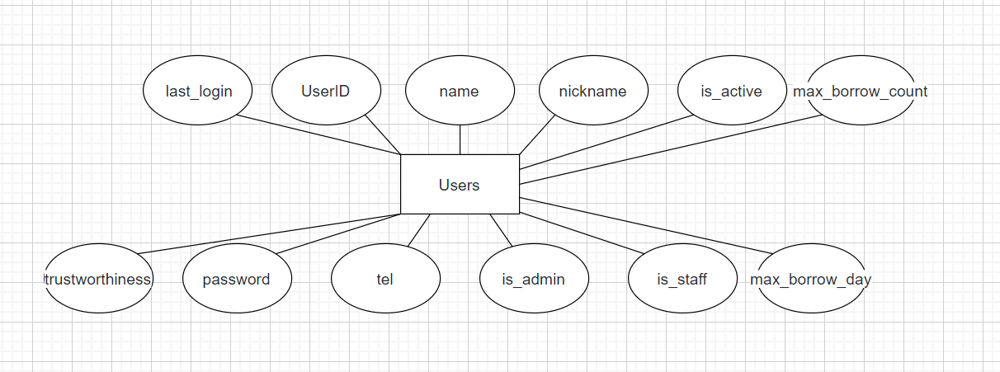
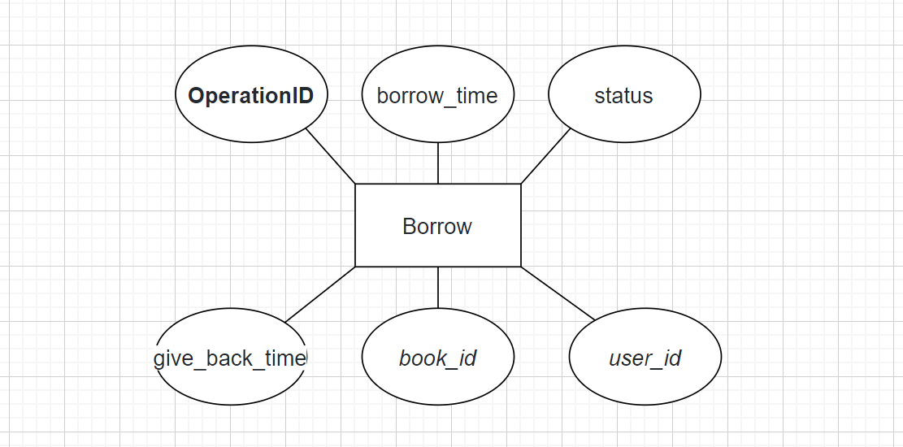
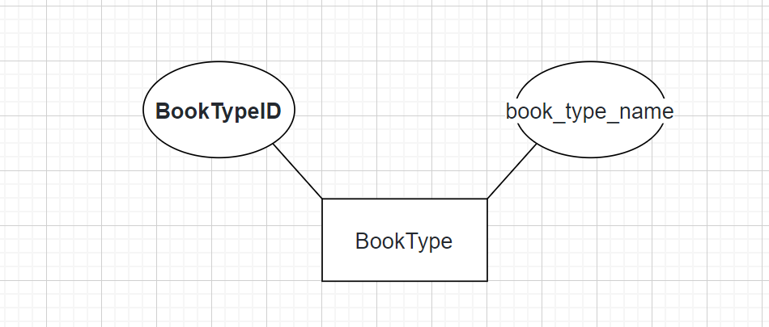
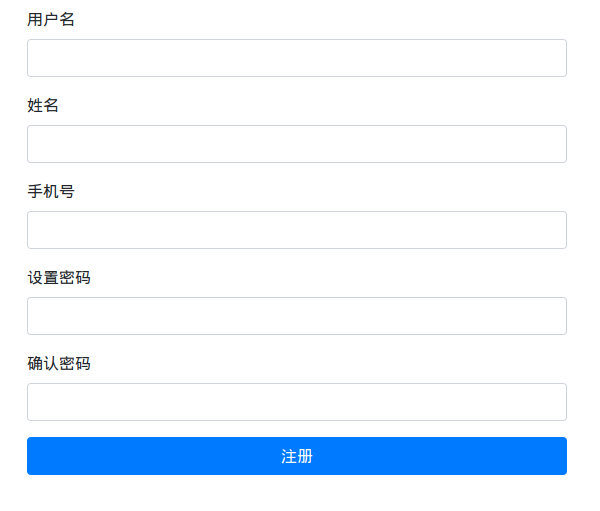
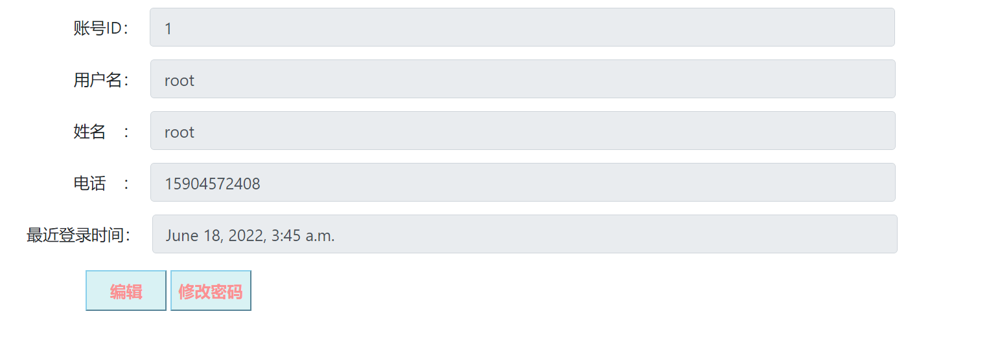
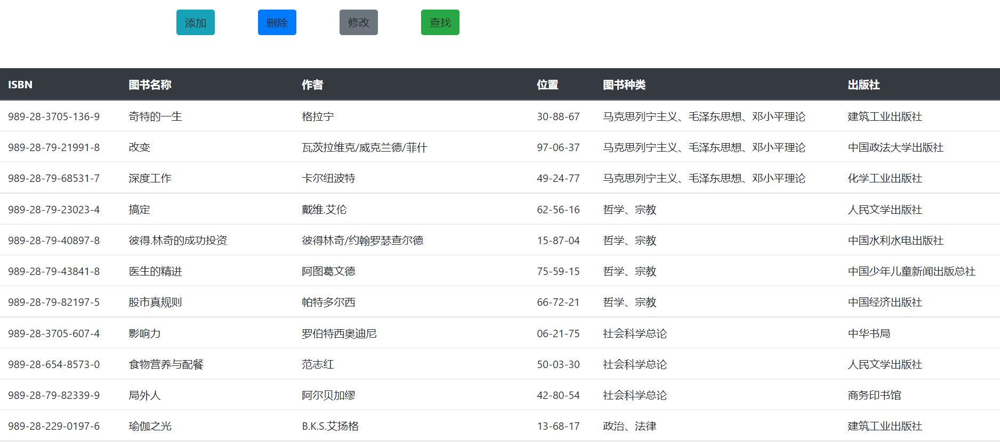
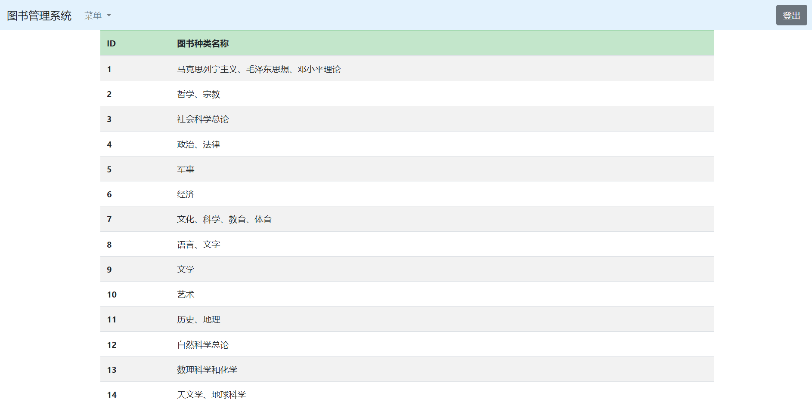
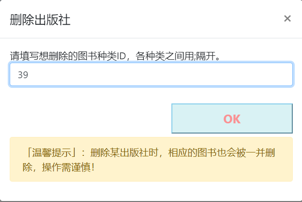

## 引言
利用所学数据库知识，设计图书管理系统。

## 1.需求分析

### 1.1 业务需求

图书室管理系统对现代图书馆而言，是能够发挥其科研的作用的至关重要的技术平台，对于读者和图书管理员来说，是否方便快速获取信息的关键，所以，图书管理系统要能够为用户提供充足的信息和快捷方便的操作手段。

### 1.2 用户需求

在图书管理系统当中，用户应该分为图书管理员和读者。从读者的角度，该系统应该具备查询图书馆内的数据信息、借书、还书等功能；从图书管理员的角度来看，该系统应该具备管理图书馆内的图书（增加、删除、修改、查询图书）、管理读者的借阅记录、对读者用户进行创建、修改、删除等操作。

### 1.3 系统需求

该系统分为四大模块，分别是用户信息、查询图书、借阅图书、借阅记录。

1. **用户信息**：展示读者的基本信息（账号ID、用户名、姓名、电话、最近登录时间、账号信息、账号状态、信用点、最长可借阅天数、最多可借阅本数），在这个模块里面可以对读者账号进行增加、删除、修改、恢复等功能，同时也可以查看被删除的用户。
2. **查询图书**：图书管理员可以录入图书信息，录入的信息会存入书目库，也可以修改图书信息，发送修改事务到修改图书信息功能，修改后的信息也会存入书目库，同时也可以删除图书信息，发送删除事务到删除图书信息功能，向书目库发送删除记录，删除对应的图书记录。图书管理员也可以查询图书信息，从书目库中取出相应的图书信息，供图书管理员查询信息。
   图书的基本信息包含ISBN、书名、作者、图书位置、图书类别、出版社。
3. **借阅图书**:图书管理员可以录入借阅记录，录入的信息会存入数据库，同时也可以修改、删除、查询借阅记录。
4. **借阅记录**：借阅记录的基本信息包含：操作序列号、借阅时间、图书状态、归还时间、借阅图书、借阅人。

## 2.所用开发工具和技术

### 2.1 数据库

数据库使用了MySQL。MySQL作为关系型数据库，基于其高可操作性和存储一致性，主要用于存储图书和用户等相关信息。MySQL 是一个高性能且相对简单的数据库系统，与一些更大系统的设置和管理相比，其复杂程度较低。

### 2.2 前后端

前后端使用了Django，Django是一个高级的 Python 网络框架，可以快速开发安全和可维护的网站。Django有开源框架和完美的文档分析支持，自助式的后端管理。Django 可以使开发的应用具有以下优点：

1. **完备性**：Django 遵循“功能完备”的理念，提供开发人员可能想要“开箱即用”的几乎所有功能。因为你需要的一切都是一个“产品”的一部分，它们都可以无缝结合在一起，遵循一致性设计原则，并且具有广泛和最新的文档。
2. **通用性**：Django 可以（并已经）用于构建几乎任何类型的网站—从内容管理系统和维基，到社交网络和新闻网站。它可以与任何客户端框架一起工作，并且可以提供几乎任何格式（包括 HTML，Rss 源，JSON，XML 等）的内容。在内部，尽管它为几乎所有可能需要的功能（例如几个流行的数据库，模版引擎等）提供了选择，但是如果需要，它也可以扩展到使用其他组件。
3. **安全性**：Django 帮助开发人员通过提供一个被设计为“做正确的事情”来自动保护网站的框架来避免许多常见的安全错误。例如，Django 提供了一种安全的方式来管理用户账户和密码，避免了常见的错误，比如将 session 放在 cookie 中这种易受攻击的做法（取而代之的是 cookies 只包含一个密钥，实际数据存储在数据库中）或直接存储密码而不是密码哈希（密码哈希是通过密码散列函数发送密码而创建的固定长度值）。Django 能通过运行哈希函数来检查输入的密码 - 加密 - 将输出的哈希值与存储的哈希值进行比较是否正确。然而由于功能的“单向”性质，即使存储的哈希值受到威胁，攻击者也难以解决原始密码。默认情况下，Django 可以防范许多漏洞，包括 SQL 注入，跨站点脚本，跨站点请求伪造和点击劫持。
4. **可扩展**：Django 使用基于组件的“无共享”架构 （架构的每一部分独立于其他架构，因此可以根据需要进行替换或更改). 在不用部分之间有明确的分隔意味着它可以通过在任何级别添加硬件来扩展服务：缓存服务器，数据库服务器或应用程序服务器。一些最繁忙的网站已经成功地缩放了 Django，以满足他们的需求（例如 Instagram 和 Disqus）。
5. **可维护性**：Django 代码编写是遵照设计原则和模式，鼓励创建可维护和可重复使用的代码。特别是它使用了不要重复自己（DRY）原则，所以没有不必要的重复，减少了代码的数量。Django 还将相关功能分组到可重用的“应用程序”中，并且在较低级别将相关代码分组或模块（ 模型视图控制器 (MVC) 模式）.
6. **灵活性**：Django 是用 Python 编写的，它在许多平台上运行。这意味着你不受任务特定的服务器平台的限制，并且可以在许多种类的 Linux，Windows 和 Mac OsX 上运行应用程序。此外，Django 得到许多网络托管提供商的好评，他们经常提供特定的基础设施和托管 Django 网站的文档。

## 3.数据库设计

### 3.1概念结构设计

#### 3.1.1 设计E-R图

（1）图书（Book）E-R图如图3.1：


<center><strong>图3.1</strong></center>

（2）读者（user）E-R图如图3.2：



<center><strong>图3.2</strong></center>

（3）借阅记录（borrow）E-R图如图3.3：



<center><strong>图3.3</strong></center>

（5）出版社（Publisher）E-R图如图3.4：


<center><strong>图3.4</strong></center>

（6）图书类别（BookType）E-R图如图3.5：



<center><strong>图3.5</strong></center>

（7）各表之间的E-R图如图3.6：


<center><strong>图3.6</strong></center>图3.7

#### 3.1.2 事务需求

1. 数据录入
   录入图书基本信息、录入读者基本信息、录入借阅记录基本信息
2. 数据更新/删除
   更新/删除图书、更新/删除读者账号、更新/删除借阅记录
3. 数据查询
   查询图书信息、查询借阅记录、查询读者信息

#### 3.1.3 数据项列表

```sql
mysql> desc Publisher;
+----------------+-------------+------+-----+---------+----------------+
| Field          | Type        | Null | Key | Default | Extra          |
+----------------+-------------+------+-----+---------+----------------+
| PublisherID    | int         | NO   | PRI | NULL    | auto_increment |
| publisher_name | varchar(40) | NO   |     | NULL    |                |
+----------------+-------------+------+-----+---------+----------------+
2 rows in set (0.00 sec)

mysql> desc BookType;
+----------------+-------------+------+-----+---------+----------------+
| Field          | Type        | Null | Key | Default | Extra          |
+----------------+-------------+------+-----+---------+----------------+
| BookTypeID     | int         | NO   | PRI | NULL    | auto_increment |
| book_type_name | varchar(40) | NO   |     | NULL    |                |
+----------------+-------------+------+-----+---------+----------------+
2 rows in set (0.01 sec)

mysql> desc Book;
+--------------+-------------+------+-----+---------+-------+
| Field        | Type        | Null | Key | Default | Extra |
+--------------+-------------+------+-----+---------+-------+
| ISBN         | varchar(20) | NO   | PRI | NULL    |       |
| book_name    | varchar(40) | NO   |     | NULL    |       |
| author       | varchar(40) | NO   |     | NULL    |       |
| location     | varchar(20) | NO   |     | NULL    |       |
| status       | varchar(5)  | NO   |     | NULL    |       |
| book_type_id | int         | NO   | MUL | NULL    |       |
| publisher_id | int         | NO   | MUL | NULL    |       |
+--------------+-------------+------+-----+---------+-------+
7 rows in set (0.00 sec)

mysql> desc Users;
+------------------+---------------+------+-----+---------+----------------+
| Field            | Type          | Null | Key | Default | Extra          |
+------------------+---------------+------+-----+---------+----------------+
| UserID           | int           | NO   | PRI | NULL    | auto_increment |
| name             | varchar(40)   | NO   |     | NULL    |                |
| nickname         | varchar(20)   | NO   |     | NULL    |                |
| password         | varchar(1024) | NO   |     | NULL    |                |
| tel              | varchar(11)   | NO   |     | NULL    |                |
| is_admin         | tinyint(1)    | NO   |     | NULL    |                |
| is_staff         | tinyint(1)    | NO   |     | NULL    |                |
| is_active        | tinyint(1)    | NO   |     | NULL    |                |
| last_login       | datetime(6)   | NO   |     | NULL    |                |
| trustworthiness  | int           | YES  |     | NULL    |                |
| max_borrow_day   | int           | YES  |     | NULL    |                |
| max_borrow_count | int           | YES  |     | NULL    |                |
+------------------+---------------+------+-----+---------+----------------+
12 rows in set (0.01 sec)

mysql> desc Borrow;
+----------------+-------------+------+-----+---------+----------------+
| Field          | Type        | Null | Key | Default | Extra          |
+----------------+-------------+------+-----+---------+----------------+
| OperationID    | int         | NO   | PRI | NULL    | auto_increment |
| borrow_time    | datetime(6) | NO   |     | NULL    |                |
| status         | varchar(8)  | NO   |     | NULL    |                |
| give_back_time | datetime(6) | NO   |     | NULL    |                |
| book_id        | varchar(20) | NO   | MUL | NULL    |                |
| user_id        | int         | NO   | MUL | NULL    |                |
+----------------+-------------+------+-----+---------+----------------+
6 rows in set (0.00 sec)
```

#### 3.1.4 系统实体

图书（Book）
用户（Users）
借阅记录（Borrow）
出版社（Publisher）
图书类别（BookType）

### 3.2逻辑结构设计

#### 3.2.1 转换规则

一个实体型转换成一个关系模型。实体的属性就是关系的属性，实体的码就是关系的码。
实体型间的关系常有如下不同的情况：

1. 一个$1:1$联系可以转换为一个独立的关系模式，也可以任意一端对应的关系模式合并。
2. 一个$1:n$联系可以转换成一个独立的关系模式，也可以与n端对应的关系模式合并。
3. 一个$m:n$联系转换成一个关系模式。
4. $3$或$3$个以上实体间的一个多联系可以转换成一个关系模式。
5. 具有相同码的关系模式可合并。

#### 3.2.2 关系模型

图书（**ISBN**，图书名称，图书类别，作者，图书位置，出版社）
出版社（**出版社ID**，出版社名称）
图书类别（**图书类别ID**，图书类别名称）
图书记录（**操作序列号**，操作时间，操作类型，*图书ID*，*读者ID*）
借阅记录（**操作序列号**，借阅时间，图书状态，归还时间，*图书ID*，*借阅人ID*）

### 3.3物理结构设计

#### 3.3.1 创建数据库

通过`mysql -u root -p`进入MySQL数据库终端，执行以下两个语句来创建数据库：

```sql
CREATE DATABASE LIMS;
USE LIMS
```

#### 3.3.2 创建基本表

登录数据库之后，在LIMS数据库内依次执行如下命令：

```sql
create table Publisher (
    PublisherID int auto_increment,
    publisher_name varchar(40) not null,
    PRIMARY KEY (PublisherID)
);

create table BookType (
    BookTypeID int auto_increment,
    book_type_name varchar(40) not null,
    PRIMARY KEY (BookTypeID)
);

create table Book (
    ISBN varchar(20),
    book_name varchar(40) not null,
    author varchar(40) not null,
    location varchar(20) not null,
    status varchar(5) default 'IN' not null CHECK (status in ('IN', 'OUT', 'LOST')),
    book_type_id int not null,
    publisher_id int not null,
    PRIMARY KEY (ISBN),
    FOREIGN KEY (publisher_id) REFERENCES Publisher(PublisherID),
    FOREIGN KEY (book_type_id) REFERENCES BookType(BookTypeID)
);

create table Users (
    UserID int auto_increment,
    name varchar(40) not null,
    nickname varchar(20) not null,
    password varchar(1024) not null,
    tel varchar(11) not null,
    is_admin tinyint(1) not null,
    is_staff tinyint(1) not null,
    is_active tinyint(1) default 1 not null CHECK (is_active in (0, 1)),
    trustworthiness int default 100 CHECK (trustworthiness between 0 and 100),
    max_borrow_day int,
    max_borrow_count int,
    PRIMARY KEY (UserID)
);

create table Borrow (
    OperationID int auto_increment,
    borrow_time datetime(6) not null,
    status varchar(8) not null CHECK (status in ('在借', '归还', '损坏', '丢失', '迟交')),
    give_back_time datetime(6) not null,
    book_id varchar(20) not null,
    user_id int not null,
    PRIMARY KEY (OperationID),
    FOREIGN KEY (user_id) REFERENCES Reader(ReaderID),
    FOREIGN KEY (book_id) REFERENCES Book(ISBN)
);
```

起初小组是这样初始化数据库的，但随着开发进行，我们已经可以使用更简单的自动化手段来创建表，并写了对应的自动化shell和bat脚本：

```shell
python Django/manage.py makemigrations
python Django/manage.py migrate
python Django/manage.py createsuperuser --UserID 0 --name root --nickname root --password bassword --tel 15904572408
```

### 3.4数据库各项技术的综合使用

#### 1.是否合理设置索引

经过小组讨论，我们认为：

- **图书**：ISBN、book_name、author三个字段的查询频率较高，因此为该三个字段创建了索引。
- **用户**：UserID、name两个字段的查询频率较高，因此为该两个字段创建了索引。
- **借阅记录**：OperationID、borrow_time两个字段的查询频率较高，因此为该两个字段创建了索引。

#### 2.SQL语句的优化是否有所考虑

在查询模块开发过程中，小组都避开了嵌套子查询的行为，并且在不定项多条件组合查询中仅当通过后端的筛选整合完成后才提交查询请求到数据库中，从而避免了一次数据查询发送多个查询请求的低效情况。

#### 3.能否合理使用存储过程和触发器

由于本项目中有信用点系统，因此我们为用户的借阅记录状态设置了触发器，当该记录的图书状态分别为在借、归还、损坏、丢失、迟交五种中的一种时，触发器会根据对应的状态来变更用户信用点，同时在状态被设置归还、损坏和迟交的情况下图书表中状态会被自动更新为IN，其他情况会被更新为OUT。

#### 4.数据库安全性是如何考虑的（比如存取控制策略），杜绝SQL注入

最初考虑选择开发技术栈的时候就考虑过安全问题。最后我们发现，由于Django有QuerySets的存在，在被参数化查询构建出来时就被保护从而免于 SQL 注入，而且查询的 SQL 代码与查询的参数是分开定义的，因此即使进行SQL注入，也只会注入到QuerySets内，而不会直接和数据库进行交互。此外，即使参数化查询中参数可能来自用户因而不安全，但它们都由底层数据库引擎进行转义，可以保证数据库的安全性。同时我们在开发的过程中也避开了使用`extra()`和`RawSQL`的功能，因此从很大程度上安全性是可靠的。

除了SQL注入之外，Django也防御了跨站点请求伪造，提到这个是因为本项目开发的较多请求是要从前端建立与后端的联系的，会直接影响到数据库的安全，因此为了避免CSRF跨域攻击，我们在发送请求的时候都会附加一个CSRF令牌，并且通过这个令牌来验证请求的有效性，从而保证了来自用户的请求是合法的，进而保证数据库的安全。另外，我们也使用了HTTPS协议进行通信，有效防止了CSRF漏洞。

此外，我们在开发的过程中也避免了如`<style class={{ var }}>...</style>`的写法，可以有效地阻断XSS攻击；Django也带有防御访问劫持的功能，可以`X-Frame-Options middleware`的形式在支持它的浏览器中阻止一个网页被渲染在`frame`的内部，在每个视图的基础上禁用保护。

#### 5.数据库完整性约束

我们在开发过程中在前端设计好逻辑来阻止用户的不规范输入，并且在后端也做了相应的检查，最后还在数据库初始化建表的期间设计好了各属性的约束，可以避免用户的多数不规范输入导致的数据库存储错误的或脏的数据。

#### 6.非关系数据库Redis的合理使用

由于在Django中参数化查询是基于QuerySets的，而QuerySets是惰性执行的，创建查询集不会带来任何数据库的访问。仅当QuerySets需要求值时，Django才会真正运行这个查询，并且会按照Django的缓存机制将执行的结果保存在内存中，因此遇到多次重用也不会影响查询性能，因此我们小组认为没有必要使用Redis数据库来支持高性能快速查询。

#### 7.数据库备份与恢复

项目实际运作中，显然重要的不是项目本身，而是项目自己所存有的数据，正所谓数据无价。我们小组也开发了数据库备份与恢复的脚本，用来方便管理员进行数据备份和恢复。此外，这个功能还支持数据库迁移，即所做的备份可以直接恢复到另外一个数据库上，只要Django支持这个数据库，数据就可以写入其中。

## 4.详细设计与实现

### 4.1 前后端创建

首先，我们根据系统框架，数据库结构设计了对应界面的前后端部分，而此次我们的项目开发是基于个人全栈开发，不分离前后端，并采用动态与静态相结合的更新方式，执行交互展示操作，同时，在细节功能开发的同时进行模块化设计，根据对各页面的熟悉程度分配具体工作，最终得以实现这个复杂的系统。

### 4.2 用户登录注册

首先，在进入图书管理系统后，首次进入页面，会弹出有登录注册操作，若不进行登录注册操作，将无法执行任何操作，而在登录注册操作后，系统会拉取后台数据库的用户信息，根据用户信息来判断当前登录注册的用户身份，如：管理员，普通用户，并根据用户身份与用户数据开放对应权限的相关数据的展示与操作。




**核心代码**：

```python
def user_login(request):
    if request.method == 'POST':
        user_login_form = get_user_model()
        if user_login_form:
            data = request.POST
            user = authenticate(username=data['username'], password=data['password'])
            if user:
                login(request, user)
                messages.info(request, "登录成功!")
                return redirect("/")
            else:
                messages.error(request, "账号或密码输入有误。请重新输入~")
        else:
            messages.error(request, "账号或密码输入不合法")
        return redirect("/user/sign_in/")
    elif request.method == 'GET':
        user_login_form = UserLoginForm()
        context = {'form': user_login_form}
        return render(request, 'static/SignIn.html', context)
    else:
        messages.error(request, "请使用GET或POST请求数据")
        return redirect("/user/sign_in/")

def user_register(request):
    if request.method == 'POST':
        user_register_form = UserRegisterForm(data=request.POST)
        if user_register_form.is_valid():
            new_user = user_register_form.save(commit=False)
            new_user.set_password(user_register_form.cleaned_data['password1'])
            new_user.save()
            login(request, new_user)
            messages.info(request, f"注册成功！你的账号ID为：{new_user.UserID}")
        else:
            messages.info(request, "注册表单输入有误。请重新输入~")
        return redirect("/user/sign_in/")
    elif request.method == 'GET':
        user_register_form = UserRegisterForm()
        context = {'form': user_register_form}
        return render(request, 'static/SignUp.html', context)
    else:
        messages.error(request, "请使用GET或POST请求数据")
        return redirect("/user/sign_in/")
```

### 4.3用户信息模块：

在用户信息模块中，我们根据需求设计了表属性：

- UserID: 主键，表示当前用户的ID，具有独一性
- Name: 系统给当前用户分配的用户名，可修改
- Nickname: 昵称，用户自行定义，展示在其他读者面前的名字
- Password: 密码，当前用户登录使用的密码
- Tel: 电话，当前用户的联系电话，电话内定义的数据格式为str，即可在电话中加入区号
- Is_admin: 判断当前用户是否为管理员
- Is_staff: 判断当前用户是否为图书馆员工
- Is_active: 判断当前账号是否为正常可用状态
- Last_login: 当前用户最后一次登录时间
- Trustworthiness: 当前用户的信用点，用以进行触发器判断
- max_borrow_day: 最大借阅天数
- max_borrow_count: 最大借阅数量

在该模块中，我们实现了不定项条件查询，基于用户的现实不同需求，用户可以随意添加条件：当前用户id，用户名，昵称，电话，近几日登录，信用点大小范围并进行查询，且我们会根据当前用户的权限就行查找并返回结果，在其中用户名和昵称根据现实情况采用了不区分大小写的模糊查找，信用点的输入在前端部分做好了安全性检查，以减少后端工作量，最后采用表单post更新的方式以最快速度返回结果，并且不需进行路由跳转即可完成




**核心代码**：

```python
def user_profile_view(request):
    current_user = request.user
    if current_user.is_anonymous:
        messages.info(request, "您还未登录，请先登录！")
        return redirect("/user/sign_in/")
    elif current_user.is_admin:
        user = User.objects.filter(UserID=current_user.UserID).values(
            'UserID', 'name', 'nickname', 'tel', 'last_login'
        )
    else:
        user = User.objects.filter(UserID=current_user.UserID).values(
            'UserID', 'name', 'nickname', 'tel',
            'last_login', 'trustworthiness',
            'max_borrow_day', 'max_borrow_count',
        )
    return render(request, 'static/UserProfile.html', {
        'isOffline': current_user.is_anonymous,
        'User': user[0],
        'isAdmin': current_user.is_admin
    })
```

### 4.4查询图书模块：

在查询图书模块中，我们根据需求设计了表属性：

- ISBN: 主键，表示图书的ISBN
- book_name: 表示图书的名称
- Author: 图书对应作者的名字
- Location: 当前图书存放在图书馆中的具体位置
- Status: 当前图书的状态
- book_type_id: 外键，图书的类别
- publisher_id: 外键，出版社的名称

同上，在该模块中，我们也实现了不定项条件查询，基于用户的现实不同需求，用户可以随意添加条件：图书ISBN，书名，图书作者，图书类型，出版社名称并进行查询,因该部分在现实意义上模糊搜索效果更好，所以，除了ISBN外，该部分的搜索条件，全部应用了不区分大小写的模糊查找，最后采用表单post更新的方式以最快速度返回结果，并且不需进行路由跳转即可完成



**核心代码**：

```python
def book_view(request):
    current_user = request.user
    conditions = dict()
    if current_user.is_anonymous:
        messages.info(request, "由于您还未登录，故访问被拒绝！")
        return redirect("/user/sign_in/")
    elif not current_user.is_admin:
        messages.info(request, "由于您还不是管理员，故访问被拒绝！")
        return redirect("/user/sign_in/")
    try:
        ISBN = request.POST['ISBN_book']
        book_name = request.POST["bkn"]
        author = request.POST["writer_name"]
        book_type = request.POST["book_type"]
        press = request.POST["press"]
        if ISBN:
            conditions['ISBN'] = ISBN
        if book_name:
            conditions['book_name__icontains'] = book_name
        if author:
            conditions['author__icontains'] = author
        if book_type:
            conditions["book_type__book_type_name__icontains"] = book_type
        if press:
            conditions['publisher__publisher_name__icontains'] = press
    except Exception as e:
        print(e)

    books = Book.objects.filter(**conditions).values('ISBN', 'book_name', 'author', 'location', 'status',
            'book_type__book_type_name',
            'publisher__publisher_name')
    return render(request, 'static/ManageBook.html', {
        'isOffline': current_user.is_anonymous,
        'books': books,
        'isAdmin': current_user.is_admin
    })
```

### 4.5借阅记录访问模块：

- OperationID: 主键，记录操作ID
- borrow_time: 记录借阅操作的发生时间
- Status: 记录该次借阅操作的图书状态
- give_back_time: 记录本次借阅操作的图书归还时间
- book_id: 外键，记录借阅的图书id
- user_id: 外键，记录借阅人的id

同上，在该模块中，我们也实现了不定项条件查询，基于用户的现实不同需求，用户可以随意添加条件：近几日借阅时间，图书状态，图书id，借阅人id并进行查询，因该部分数据涉及图书管理内部操作，故该部分只限管理员权限成员访问，且以上部分数据不适合使用模糊搜索，采用区分大小写的全字搜索就可搜索，时间上根据当前日期向前推进日期，最后采用表单post更新的方式以最快速度返回结果，并且不需进行路由跳转即可完成


**核心代码**：

```python
def show_recordings(request):
    current_user = request.user
    conditions = dict()
    if current_user.is_anonymous:
        messages.info(request, "由于您还未登录，故访问被拒绝！")
        return redirect("/user/sign_in/")
    elif not current_user.is_admin:
        user_id = int(request.session.get('_auth_user_id'))
        conditions['user_id'] = user_id
    try:
        time = request.POST['time']
        state = request.POST['state']
        book = request.POST['book']
        person = request.POST['person']
        if time:
            now = datetime.datetime.now()
            end = now - datetime.timedelta(days=int(time))
            conditions['borrow_time__range'] = (end, now)
        if state != '不限':
            conditions['status'] = state
        if book:
            conditions['book_id'] = book
        if person:
            conditions['user_id'] = person
    except Exception as e:
        print(e)
    borrows = Borrow.objects.filter(**conditions).values()
    return render(request, 'static/ManageBorrow.html', {
        'isOffline': current_user.is_anonymous,
        'borrows': borrows,
        'isAdmin': current_user.is_admin
    })
```
### 4.6出版社管理模块：

- PublisherID: 主键，记录出版社ID
- publisher_name: 记录出版社名称

同上，在该模块中，展示着全部存入数据库的出版社ID和名称，同时在该模块中我们可以添加、删除出版社信息


**核心代码：**

```python
def add_publisher(request):
    if request.method == 'POST':
        data = request.POST['addPublisher']
        types = data.split(';')
        for book_type in types:
            if book_type == '':
                continue
            item = Publisher(publisher_name=book_type)
            item.save()
        messages.info(request, "出版社添加成功！")
    return redirect("/pubm/")
 def remove_publisher(request):
    if request.method == 'POST':
        data = request.POST['delPublisher']
        types = data.split(';')
        for to_del in types:
            if to_del == '':
                continue
            try:
                item = Publisher.objects.get(PublisherID=to_del)
                item.delete()
            except:
                messages.info(request, "出版社删除失败！可能原因是已经删除或者不存在该出版社！")
                return redirect("/pubm/")
        messages.info(request, "出版社删除成功！")
        return redirect("/pubm/")
```

### 4.7图书种类管理模块：

- BookTypeID: 主键，记录图书类别ID
- book_type_name: 记录图书类别名称

同上，在该模块中，展示着全部存入数据库的图书类别ID和名称，同时在该模块中我们可以添加、删除图书种类信息。

**核心代码**：

```python
def booktype_view(request):
    current_user = request.user
    if current_user.is_anonymous:
        messages.info(request, "由于您还未登录，故访问被拒绝！")
        return redirect("/sign/in/")
    elif current_user.is_admin:
        book_types = BookType.objects.all()
        return render(request, 'static/ManageBookType.html', {
            'isOffline': current_user.is_anonymous,
            'booktypes': book_types,
            'isAdmin': current_user.is_admin
        })
    else:
        messages.info(request, "由于您还不是管理员，故访问被拒绝！")
        return redirect("/sign/in/")
```



**核心代码：**

```python
def add_book_type(request):
    if request.method == 'POST':
        data = request.POST['addType']
        types = data.split(';')
        for book_type in types:
            if book_type == '':
                continue
            item = BookType(book_type_name=book_type)
            item.save()
        messages.info(request, "图书种类添加成功！")
    return redirect("/btm/")


def remove_book_type(request):
    if request.method == 'POST':
        data = request.POST['delType']
        types = data.split(';')
        for to_del in types:
            if to_del == '':
                continue
            try:
                item = BookType.objects.get(BookTypeID=to_del)
                item.delete()
            except:
                messages.info(request, "图书种类删除失败！可能原因是已经删除或者不存在该类！")
                return redirect("/btm/")
        messages.info(request, "图书种类删除成功！")
        return redirect("/btm/")
```


### 4.8用户图书借阅管理模块：
- ISBN: 主键，表示图书的ISBN
- book_name: 表示图书的名称
- Author: 图书对应作者的名字
- Location: 当前图书存放在图书馆中的具体位置
- Status: 当前图书的状态
- book_type_id: 外键，图书的类别
- publisher_id: 外键，出版社的名称

同上，在该模块中，展示着全部存入数据库的图书信息，用户可在该模块中借阅图书，选择一本或以上图书后，输入借阅天数，若借阅成功则会出现借阅成功提示，同时图书的状态会由IN转变为OUT；借阅成功后会生成一个相对应的借阅记录。


**核心代码：**

```python
@receiver(post_save, sender=Borrow)
def trigger_update_book_status(sender, instance, **kwargs):
    book_item = Book.objects.get(ISBN=instance.book_id)
    if instance.status == '归还' or instance.status == '损坏':
        book_item.status = 'IN'
    else:
        book_item.status = 'OUT'
    book_item.save()

    user_id = instance.user_id
    user = User.objects.get(UserID=user_id)
    if instance.status == '归还' and user.trustworthiness < 100:
        user.trustworthiness += 1
    elif instance.status == '损坏' and user.trustworthiness > 0:
        user.trustworthiness -= 25
    elif instance.status == '丢失' and user.trustworthiness > 0:
        user.trustworthiness -= 50
    elif instance.status == '迟交' and user.trustworthiness > 0:
        user.trustworthiness -= 10
    user.trustworthiness = max(0, user.trustworthiness)

    user.max_borrow_day = int(user.trustworthiness / 100 * settings.MAX_BORROW_DAY)
    user.max_borrow_count = int(user.trustworthiness / 100 * settings.MAX_BORROW_COUNT)
    user.save()
```

### 4.9用户管理模块：
- UserID: 主键，表示当前用户的ID，具有独一性
- Name: 系统给当前用户分配的用户名，可修改
- Tel: 电话，当前用户的联系电话，电话内定义的数据格式为str，即可在电话中加入区号
- Is_active: 判断当前账号是否为正常可用状态
- Last_login: 当前用户最后一次登录时间
- Trustworthiness: 当前用户的信用点，用以进行触发器判断
- max_borrow_day: 最大借阅天数
- max_borrow_count: 最大借阅数量

这个模块是管理员页面才有的模块功能，在这个模块当中展示所有已存入数据库的用户信息，同时可以修改、删除用户；管理员可以查看已删除用户的相关信息，也可将已被删除的用户恢复；管理员也可以查找现有用户，且以上部分数据不适合使用模糊搜索，需要指定账户的信息，当多条件输入时，不同时符合多条件就无法查找信息。


**核心代码：**

```python
def remove_user(request):
    if request.method == "POST":
        user_operated_id = request.POST['del_UserID']
        if user_operated_id == '1':
            messages.info(request, "用户删除失败，超级管理员不能被删除！")
        else:
            user = User.objects.get(UserID=user_operated_id)
            if user:
                user.is_active = False
                user.save()
                messages.info(request, "用户删除成功！")
            else:
                messages.info(request, "用户删除失败，可能原因是已经删除或者不存在该用户！")
        return redirect("/user/manage/")


def restore_user(request):
    if request.method == "POST":
        user_operated_id = request.POST['del_UserID']
        if User.objects.filter(UserID=user_operated_id).exists():
            user = User.objects.get(UserID=user_operated_id)
            user.is_active = True
            user.save()
            messages.info(request, "用户恢复成功！")
        else:
            messages.info(request, "用户恢复失败，可能原因是已经恢复或者不存在该用户！")
        return redirect("/user/manage/")


def pull_query_user_info(request):
    if request.method == "GET":
        pull_UserID = request.GET['pull_UserID']
        query_obj = User.objects.filter(UserID=pull_UserID)
        if query_obj.exists():
            query_data = query_obj.values()[0]
            data = {
                "name": query_data["name"],
                "nickname": query_data["nickname"],
                "tel": query_data["tel"],
            }
            return JsonResponse(data)
        else:
            return JsonResponse({})


def update_user(request):
    if request.method == "POST":
        post_data = request.POST
        user_to_update = User.objects.get(UserID=int(post_data['UserID']))
        if post_data['update_user_password'] == '':
            pass
        else:
            user_to_update.set_password(post_data['update_user_password'])
        user_to_update.nickname = post_data['update_user_nickname']
        user_to_update.name = post_data['update_user_name']
        user_to_update.tel = post_data['update_user_telephone']
        user_to_update.save()
        messages.info(request, "用户信息修改成功！")
    return redirect("/user/manage/")
```

## 5.测试

### （1）功能测试
（1）登录：
1. 输入正确的账号密码，是否正确登录并跳转至主页面。

2. 账号为空，输入密码，是否提示输入密码。

3. 输入账号，密码为空，是否提示输入用户名。

4. 账号密码均为空，是否提示请输入用户名/密码。

5. 账号或密码不正确，是否提示账号或用户名错误。

6. 点击注册账号，是否跳转到对应页面。

7. 点击登出账号，是否会出现登出失败/登出成功的提示。

   

   


（2）新增信息：
1. 点击新增图书/用户/借阅记录,是否弹出新增的各个信息。

2. 新增成功后,是否提示操作成功。

3. 新增成功后，刷新页面是否会出现新增信息。

   

   

（3）修改信息：
1. 选中一条信息,点击修改，是否弹出修改框。

2. 修改完成,点击提交,是否提示操作成功。

3. 修改完成,点击关闭,页面信息是否修改成功。

4. 如果修改信息，没有首先查询ID等主键，则提示输入。

   

   

（4）删除信息： 
1. 选中一条或者多条，点击删除，是否提示删除成功。

2. 删除图书\账号\借阅记录，如果没有输入相关要删除的ID，是否会出现提示框。

3. 选中一条或多条信息,点击取消按钮,是否可以取消删除。

   

   

（5）查询信息：
1. 点击查询按钮，是否会出现查找的信息输入框。

2. 如果没有输入要查找的信息，是否会出现提示框。

3. 不存在输入的相关信息，是否会出现不存在的提示框。

4. 输入存在的信息，是否会在界面展示要查找的信息。

   

   

### （2）web开发
兼容性测试：
1. 浏览器兼容测试：在不同浏览器如Microsoft Edge、Google Chrome、百度浏览器、火狐浏览器、夸克、qq浏览器等常见浏览器中能够正常运行，功能正常使用
2. 屏幕尺寸和分辨率兼容测试：前端使用bootstrap框架栅格系统和flex布局使得页面具有更高的兼容性，pc端缩小屏幕后页面布局基本不变。由于未使用并不考虑移动端开发，当切换至移动端时页面内容会变小。页面板在分辨率模式分别为1280 * 1024、1027 * 768、800 * 600等常见分辨率中能正常显示，字体符合要求。
3. 操作系统兼容测试：程序在windows和linux两个不同的系统中能正常运行，功能正常使用，显示正常。
4. 服务端测试：将数据库建立在本地与服务器上，修改配置后，功能正常使用，页面与布局基本不变。

性能测试：
1. 预期性能测试：用户点击跳转时实现新页面跳转，跳转加载速度不低于2.29秒
2. 用户并发测试：通过逐渐增加用户数量来加重系统负担，对用户并发进行压力测试。系统可承受十位用户以内的并发请求。当多用户都同时进入搜索时，我们将虚拟用户数据库数量进行并发用户数执行时间思考：100 100000 搜索页面随机产生30分钟加入思考时间，100 200000 搜索页面随机产生30分钟加入思考时间。一定数据库数量级，不同量虚拟用户的情况下，搜索结果是在将符合条件的所有结果集均发送到前台页面，对于页面显示对性能的消耗可以忽略不计。

### (3)安全性测试
1. 如果有SQL注入,是否可以正常操作。
2. 单次操作是否会保存记录。

## 6  存在的问题及改进思路
1. 管理员只有一个，实际上在面对更大规模的图书管理需求时管理会更困难。

   **解决思路**：设计时考虑到这个可能性，提前预留了is_staff字段，由管理员管理职工，职工去管理普通用户等信息。届时需要修改相关权限认证。

2. 前端代码过于臃肿，重复性较高，前后端耦合性也较强。

   **解决思路**：充分发挥模板引擎的高效性，将重复的部分抽象成一个组件，再由具体的应用层去include需要的组件。

3. 图书的ISBN在输入上较麻烦。

   **解决思路**：开发红外线输入设备的API，能够通过扫描直接输入ISBN。

4. 用户ID不太常见，更常见的应该是数字序列或者UUID序列的。

   **解决思路**：优化项目内认证方式，在保证允许昵称重复的情况下可以唯一确定到用户，再修改用户ID的数据类型。

5. 在添加图书中，而出版社不存在出版社表中，系统不会自动添加。

   **解决思路**：新增一个触发器来完成这一自动添加的过程。

6. 在删除出版社或图书种类时会级联删除，增大误操作的风险。

   **解决思路**：一方面要为考虑误操作设计多重验证，另一方面考虑加入新的表来缓存被删除的数据，并做定期删除清空，避免冗余数据长期占用资源。

7. 批量管理在一部分页面中建设还不全。

   **解决思路**：优化这部分页面的前后端交互部分，使其能够动态根据复选框来发送对应的数据。

